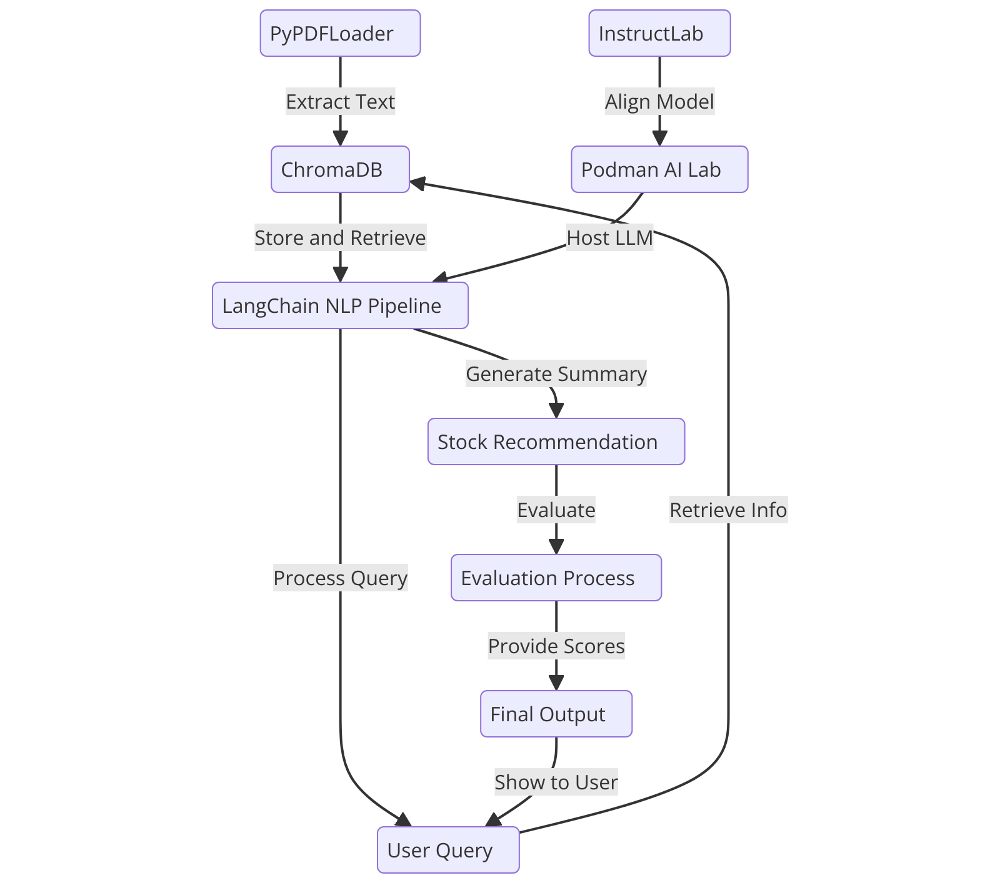

<div align="center">

  
  <h1>MarketMaestro</h1>
  
  <p>
    An AI Agent for Stock Recommendation 
  </p>
</div>

## Project Overview

MarketMaestro is an experimental Financial AI agent which acts as a demonstrative project designed to explore the process of AI alignment in the context of stock recommendations and investment. While focusing on a stock recommendation scenario, the intent is to illustrate key principles of AI alignment that are applicable across various fields where AI assistants are being integrated.

MarketMaestro is built to run locally using small language models and open-source tools, an approach that offers several key benefits:

- Enhanced Privacy: By processing data locally, we can ensure that sensitive financial information never leaves the user’s device.
- Greater Transparency: Smaller models and open-source components are often more interpretable, allowing us to better understand and explain their decision-making processes.
- Improved Control: Local deployment allows for easier fine-tuning and adjustment of the model’s behaviour to align with specific ethical guidelines, potentially even tailoring them to the analyst style.
- Reduced Resource Requirements: Small models can run efficiently on personal computers, democratising access to AI-powered analysis.
- Openness and Auditability: The use of open-source tools allows for thorough code review and community-driven improvements, crucial for systems handling sensitive data.

## Architecture

MarketMaestro is designed as a modular system, leveraging several open-source technologies to create a locally-run, aligned AI stock advisor. Let’s break down the key components of the system and understand their purposes and selection criteria, following the simple FlowChart below.

<p align="center">
  
</p>

### InstructLab
InstructLab is used specifically for model alignment in our project. It employs a method called Large-scale Alignment for chatBots (LAB), which enhances LLMs using far less human-generated information and fewer computing resources than typical retraining methods. InstructLab’s approach includes taxonomy-driven data curation, large-scale synthetic data generation, and iterative, large-scale alignment tuning. This allows us to improve our model’s alignment efficiently, making it more suitable for specific contexts and use cases of providing stock recommendations.

### Podman AI Lab
Podman AI Lab serves as our local environment for working with Large Language Models. Podman AI Lab provides by default a recipe catalog with common AI use cases, a curated set of open source models, and a playground for learning, prototyping, and experimentation. In our case, we use Podman AI Lab to serve our InstructLab merlinite-7b-lab model locally, ensuring data privacy and security. This approach also allows us to quickly get started with AI in our application without depending on infrastructure beyond our laptop.

### LangChain
LangChain is the backbone of our natural language processing (NLP) pipeline, including the creation of summarisation and recommendation chains. It offers a flexible and powerful framework for building language model applications, allowing us to easily create complex NLP chains essential for our AI agent to process financial reports and generate recommendations. LangChain’s modular nature facilitates easier alignment and adjustment of the AI’s behaviour. Its comprehensive toolkit for agent creation allows us to define the agent’s behaviour, decision-making process, and interaction with other components.

We also leverage LangChain for building the agent custom evaluator. For evaluation, LangChain’s flexible prompt templates and output parsers enable us to create a robust system for assessing the AI’s performance and alignment with our model guidelines including safety requirements.

### ChromaDB
ChromaDB serves as our vector database for implementing Retrieval-Augmented Generation (RAG). It provides an efficient way to store and retrieve relevant information from financial reports, which is crucial for providing context to our language model, allowing it to make more informed recommendations from recent financial data, in this case 10-K and 10-Q filings from the US Stock Exchange and Securities Commission. We use ChromaDB with its in-memory mode and load financial reports dynamically as part of the recommendation process for ease of deployment and repeatability.

### PyPDFLoader
We use PyPDFLoader for loading and processing PDF documents, specifically annual reports. Many financial reports are available in PDF format, and PyPDFLoader provides a straightforward way to extract text from these documents, which is necessary for our information retrieval system.

### System Flow
The MarketMaestro system operates as follows:

1. Annual reports are loaded and processed using PyPDFLoader.
2. Processed text is embedded and stored in ChromaDB.
3. When a user query is received, the AI agent (built with LangChain) performs the following steps: a. Retrieves relevant information from ChromaDB. b. Generates a summary of the retrieved information. c. Uses the summaries to generate a response, including stock recommendation.
4. The recommendation is then evaluated by the custom evaluator (also built with LangChain) for relevance, specificity, justification, diversity and risk awareness.
5. The final recommendation including evaluation scores and the basis for evaluation are provided to the user.

This architecture allows for a flexible, locally-run AI system that can provide stock recommendations while supporting privacy, transparency, and ethical alignment.

## Installation

1. Ensure you have Python 3.8+ installed on your MacBook.
2. Clone this repository:

   ```
   git clone https://github.com/yourusername/stock-recommendation-project.git
   cd stock-recommendation-project
   ```
3. Replace the placeholder MODEL_SERVICE and API_KEY in src/config.py with your actual values if they differ.
4. Add company reports in PDF format under `data/annual_reports/`. A good source for such reports is the [US Securities and Exchange Commission Filing Search](https://www.sec.gov/search-filings) 10-K and 10-Q reports viewed as HTML and saved in PDF.
5. Run the setup script to create a virtual environment and install dependencies:

   ```
   ./setup.sh
   ```

## Usage example


1. Activate the virtual environment:

   ```
   source venv/bin/activate
   ```

2. Run the agent:

   ```
   python run_agent.py
   ```

3. Run the evaluator:

   ```
   python run_evaluator.py
   ```

## Project Structure

- `src/agent.py`: Contains the stock recommendation agent
- `src/evaluator.py`: Contains the evaluation logic
- `src/config.py`: Configuration settings
- `data/annual_reports/`: Directory to store company annual or quarterly reports (PDF format)
- `tests/`: Contains unit tests

## Running Tests

To run tests, activate the virtual environment and run:
```
python -m unittest discover tests
```

## Contributing

For any questions, bugs or feature requests please open an [issue](<https://github.com/finos/MarketMaestro/issues)
For anything else please send an email to {project mailing list}.

To submit a contribution:

1. Fork it (<<https://github.com/finos/MarketMaestro/fork>)
2. Create your feature branch (`git checkout -b feature/fooBar`)
3. Read our [contribution guidelines](.github/CONTRIBUTING.md) and [Community Code of Conduct](https://www.finos.org/code-of-conduct)
4. Commit your changes (`git commit -am 'Add some fooBar'`)
5. Push to the branch (`git push origin feature/fooBar`)
6. Create a new Pull Request

_NOTE:_ Commits and pull requests to FINOS repositories will only be accepted from those contributors with an active, executed Individual Contributor License Agreement (ICLA) with FINOS OR who are covered under an existing and active Corporate Contribution License Agreement (CCLA) executed with FINOS. Commits from individuals not covered under an ICLA or CCLA will be flagged and blocked by the FINOS Clabot tool (or [EasyCLA](https://community.finos.org/docs/governance/Software-Projects/easycla)). Please note that some CCLAs require individuals/employees to be explicitly named on the CCLA.

_Need an ICLA? Unsure if you are covered under an existing CCLA? Email [help@finos.org](mailto:help@finos.org)_

## License

Copyright 2024 Vincent Caldeira

Distributed under the [Apache License, Version 2.0](http://www.apache.org/licenses/LICENSE-2.0).

SPDX-License-Identifier: [Apache-2.0](https://spdx.org/licenses/Apache-2.0)
